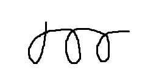

# Reveal.js 簡易説明

---

## プレゼンテーションの操作

- スライド移動: 矢印キー
- スライド全体を見る: Esc
- フルスクリーンモード: F（解除はEsc）
- 発表者モード用ウィンドウを出す: S
- ズーム: Alt + クリック

---

## ノート

発表者モードで読めるノートを挟める。

ノートはスライドには表示されない。

Note:
speaker notes

---

## 下にもページ

`reveal.js`では下にもスライドを出せる。

----

スライドにタイトルをつける必要もない。

---

## 画像



画像を表示できる。

---

## リンク

[Google](https://google.com)

---

## コード

```python
def add(a, b=1):
    return a + b
```

---

## フラグメント

- 大きくなる <!-- .element: class="fragment grow" -->
- 小さくなる <!-- .element: class="fragment shrink" -->
- 消える <!-- .element: class="fragment fade-out" -->
- 現れる <!-- .element: class="fragment fade-up" -->
- 現れて一時的に強調 <!-- .element: class="fragment fade-in-then-semi-out" -->
- 一時的に色変え <!-- .element: class="fragment highlight-current-blue" -->
- 色変え <!-- .element: class="fragment highlight-blue" -->
